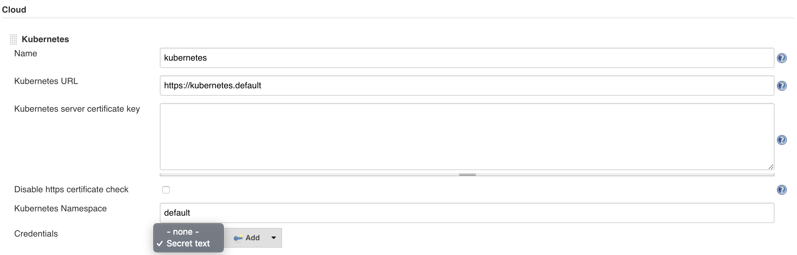
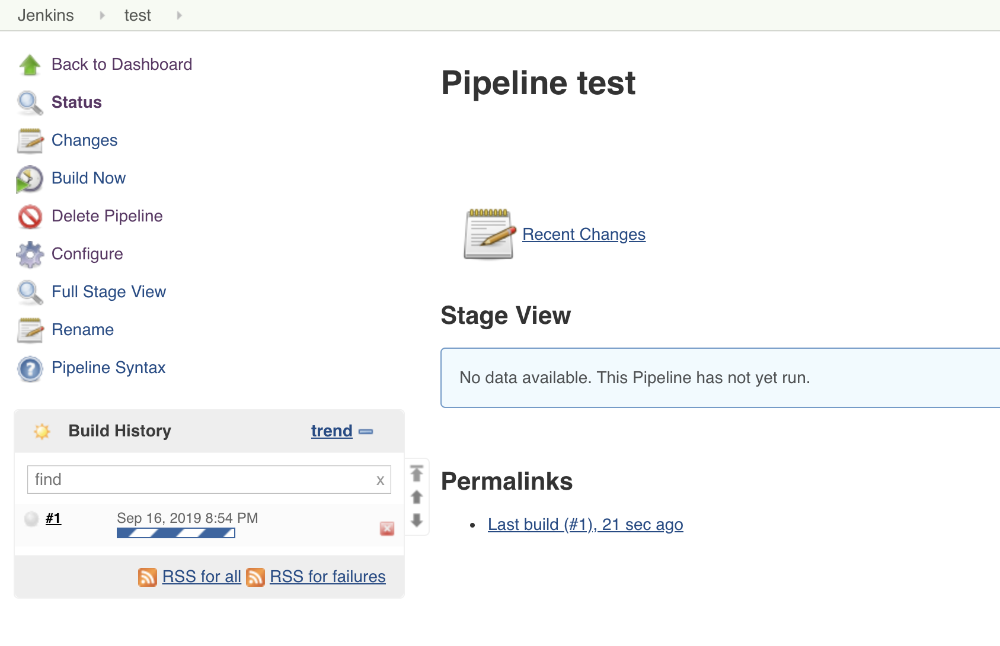
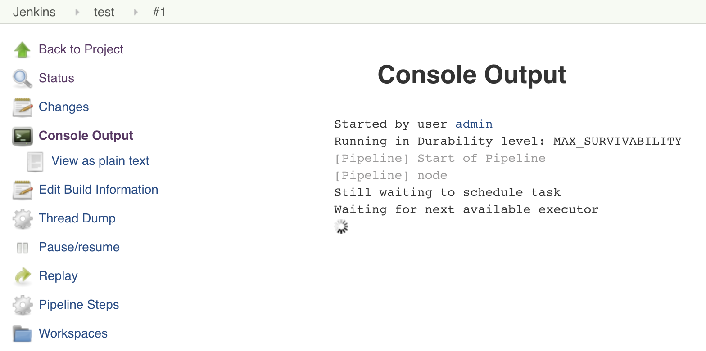
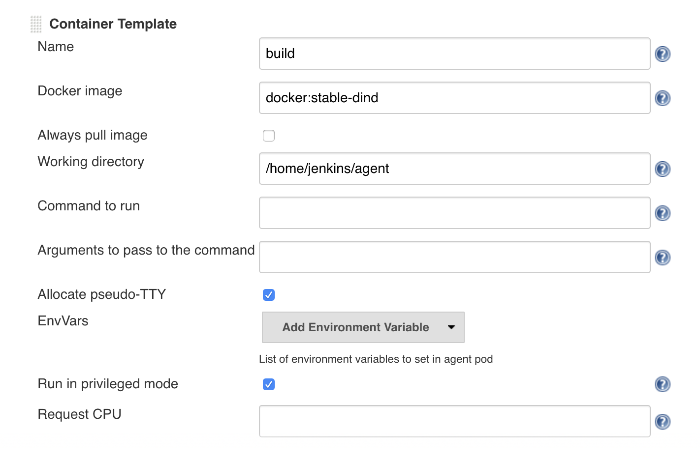
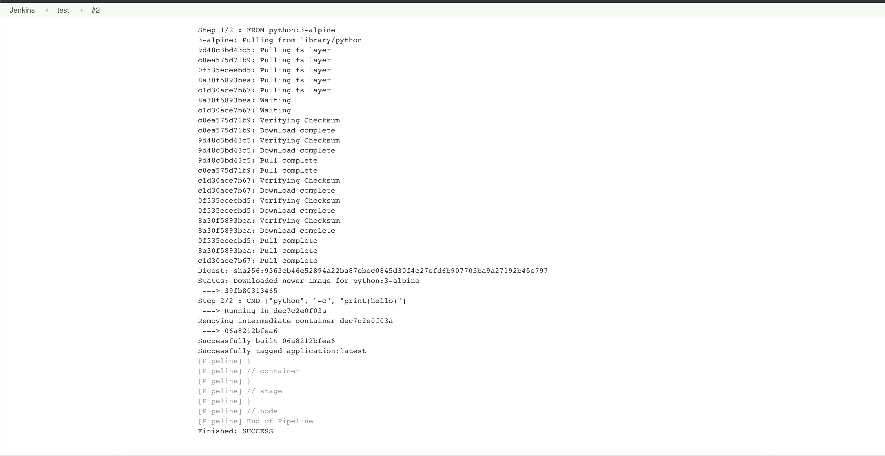
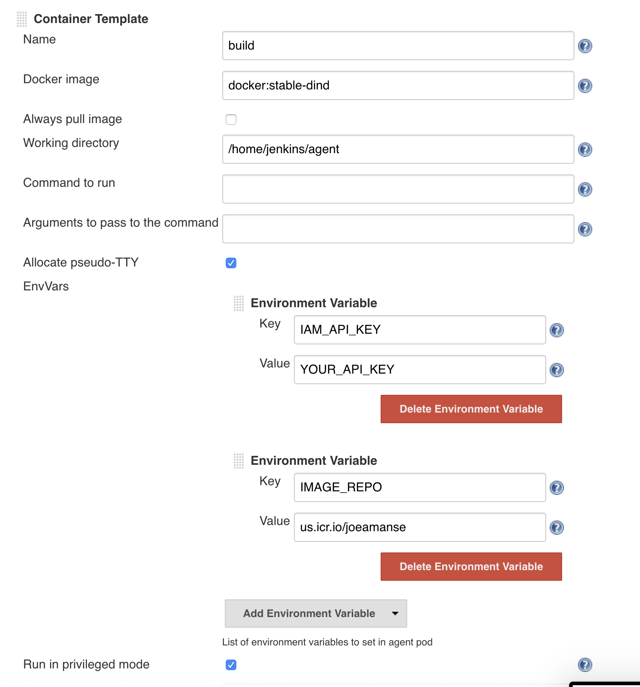

# deploy-and-run-jenkins-on-kubernetes-in-the-cloud

#### Prerequisites
_(lite/free cluster should be possible)_

~~Note: You will need the paid tier of IKS, as you will need load balancing capabilities to complete this tutorial. Please see the catalog for more information.~~

### Step 1.
_(installing helm with RBAC config)_

You should already have the Helm client installed, per the prerequisites, so now you need to to install the server-side component of Helm called Tiller. Tiller is what the Helm client talks to and it runs inside of your cluster by managing the chart installations. (For more information on Helm you can check out this Helm 101 repo.)

**---modification---**

Before installing helm in your kubernetes cluster, you will need create a cluster role binding for the Tiller to work. To do this, create a file named `rbac-config.yaml` with these lines inside.
```
apiVersion: v1
kind: ServiceAccount
metadata:
  name: tiller
  namespace: kube-system
---
apiVersion: rbac.authorization.k8s.io/v1
kind: ClusterRoleBinding
metadata:
  name: tiller
roleRef:
  apiGroup: rbac.authorization.k8s.io
  kind: ClusterRole
  name: cluster-admin
subjects:
  - kind: ServiceAccount
    name: tiller
    namespace: kube-system
```

Now you will need to apply the configuration to your Kubernetes cluster using `kubectl` and then you can install helm's Tiller using `helm`. Run the following commands to install helm properly:

```
$ kubectl apply -f rbac-config.yaml
$ helm init --service-account tiller
```

**---end of modification---**

Running `helm ls` should execute without error. If you see an error that says something like `Error: could not find a ready tiller pod`, wait a little longer and try again.

### Step 2.
_(volume.yaml file is missing. Ask the user to create a volume.yaml file. Modified jenkins installation to fit new Jenkin's helm chart version)_

**---reworked step---**

Prior to installing Jenkins, you need to first create a persistent volume. Create a file named `volume.yaml` and insert these lines:
```
---
kind: PersistentVolume
apiVersion: v1
metadata:
 name: jenkins-pv
spec:
 claimRef:
   namespace: default
   name: jenkins
 capacity:
   storage: 8Gi
 accessModes:
   - ReadWriteOnce
 persistentVolumeReclaimPolicy: Retain
 hostPath:
   path: "/mnt/k8s_volume/jenkins_home"
---
apiVersion: v1
kind: PersistentVolumeClaim
metadata:
  annotations:
    volume.beta.kubernetes.io/storage-class: ""
  name: jenkins
  labels:
    app: jenkins-pv
spec:
  accessModes:
    - ReadWriteOnce
  resources:
    requests:
      storage: 8Gi

```
Now you can install Jenkins by using the Helm chart in the stable repository. This is the default Helm repository, specifically this chart, which will be installed.

~~This chart has a number of configurable parameters. For this installation, the following parameters need to be configured:~~
* ~~rbac.install – Setting this to true creates a service account and ClusterRoleBinding, which is necessary for Jenkins to create pods.~~
* ~~Persistence.Enabled – Enables persistence of Jenkins data by using a PVC.~~
* ~~Persistence.StorageClass – When the PVC is created it will request a volume of the specified class. In this case, it is set to jenkins-pv, which is the storageClassName of the volume that was created previously. Setting this to the same value as the class name from volume.yaml ensures that Jenkins will use the persistent volume already created. Here’s how to set the same value:~~

This chart has a number of configurable parameters. For this installation, you will need to modify the plugins for Jenkins. We will also use the volume we created by specifying it in a YAML file. To do this, create a file named `values.yaml` and insert these lines:
```
master:
  installPlugins:
  - kubernetes:1.19.0
  - workflow-job:2.35
  - workflow-aggregator:2.6
  - credentials-binding:1.19
  - git:3.11.0
persistence:
  existingClaim: jenkins
```

Now you can install Jenkins through the helm command line with the values.yaml file. Jenkins Helm Chart Version 1.7.0 will be used in this tutorial.
```
helm install --name jenkins stable/jenkins -f values.yaml --version 1.7.0
```

To check if Jenkins is finished setting up and running, run `kubectl get pods` and you should get the following output that says the Pod's status is **Running**.

```
NAME                       READY   STATUS    RESTARTS   AGE
jenkins-67bd95668b-c6tp7   1/1     Running   0          11m
```

### Step 3.
_(additional paragraph to make use of NodePort for users with free clusters)_

**---additional paragraph at the end of step 3---**
Note: If you're using a free IBM Cloud Kubernetes cluster, load balancers are not available but you can use NodePort instead for development purposes. Run the following commands to get your worker's external IP and NodePort of the Jenkins service.
```
$ export NODEPORT=$(kubectl get svc jenkins -o jsonpath='{.spec.ports[].nodePort}')
$ export WORKER_EXTERNAL_IP=$(kubectl get nodes -o jsonpath='{.items[0].status.addresses[?(@.type=="ExternalIP")].address}')
$ echo http://$WORKER_EXTERNAL_IP:$NODEPORT/login
```

### Step 4.
_(Update Configure Jenkins to Configure System. Also additional sentence to make sure user selects the newly added credential)_

**---edited sentence---**

Navigate to **Manage Jenkins > Configure ~~Jenkins~~ System > Cloud section > Credentials**, then select “Add.” After adding the credentials, select it by choosing "Secret text" from the dropdown menu of the credentials section.

_(Additional screenshot below the next one)_



_(Additional paragraph to view pipeline build output - before **Add additional containers** section)_

##### Run the pipeline and view build output

After adding the pipeline script, you can now run it by clicking on **Build Now** at the sidebar of your Jenkins dashboard. This will create a new build with a **#1** label. Click on **#1** on the **Build History** section and click on **Console Output**. This will show the progress of your pipeline and execute your pipeline script such as `sh "node --version"`.




### Step 5.
_(Dockerfile is missing. Clusters v1.11+ no longer has a docker socket in their worker nodes as they are now using containerd. Solution is to use docker-in-docker image instead of alpine. docker login -u token change to docker login -u iamapikey)_

**---Step 5 Reworked---**
Docker images can be built as part of the pipeline. Create another container named `build` by using the `docker:stable-dind` image with the environment variable. Add the container by going to **Manage Jenkins > Configure System > Cloud section** like the one you did for adding the `nodejs` container. Make sure **Command to run** and **Arguments to pass to the command** are empty. Also, make sure it runs as privileged by clicking on **Advanced** and checking the **Run in privileged mode**. The screenshot below is the configuration for the `build` container.



To use this container, you can configure the pipeline `test` you created and add a new stage. Replace the previous pipeline script to this new one:

```
pipeline {
  agent any

  stages {
    stage('Test') {
      steps {
        container('nodejs') {
          sh "node --version"
        }
      }
    }

    stage('Build') {
      steps {
        container('build') {
            sh 'echo \'FROM python:3-alpine\' >> Dockerfile'
            sh 'echo \'CMD ["python", "-c", "print(\'hello\')"]\' >> Dockerfile'
            sh 'docker build -t application .'
        }
      }
    }
  }
}
```

This script creates a simple Dockerfile based on an Python image and just prints hello. The script then uses the Dockerfile to build a Docker image. You can try running your pipeline again by clicking on **Build Now** on your Jenkins dashboard and view its progress on **Console Output**. This should be similar to the one you did at [Run the pipeline and view build output]() step. Screenshot below is the Console Output of building the Docker image.



##### Push images to the IBM Container Registry
Finally, we can push our images to the [IBM Container Registry](https://cloud.ibm.com/kubernetes/catalog/registry). Automatically pushing images requires an API key:

```
$ ibmcloud iam api-key-create
```

For the container registry, you will need a namespace. Create a new one if you haven't yet by running the following command:

```
$ ibmcloud cr namespace-add YOUR_DESIRED_NAMESPACE_NAME
```

This API key can be passed into the pipeline via environment variables. In the container configuration of `build`, add a new environment variable named `IAM_API_KEY` and `IMAGE_REPO`. `IMAGE_REPO` value is `us.icr.io/YOUR_NAMESPACE`. The screenshot below is an example of the environment variables for the `build` container.



You will also need to update your pipeline script to log in to the registry and push the image. Replace the previous pipeline script again to this new one:

```
pipeline {
  agent any

  stages {
    stage('Test') {
      steps {
        container('nodejs') {
          sh "node --version"
        }
      }
    }

    stage('Build') {
      steps {
        container('build') {
            sh 'echo \'FROM python:3-alpine\' >> Dockerfile'
            sh 'echo \'CMD ["python", "-c", "print(\'hello\')"]\' >> Dockerfile'
            sh 'docker build -t application .'
            sh 'docker login -u iamapikey -p ${IAM_API_KEY} us.icr.io'
            sh 'docker tag application ${IMAGE_REPO}/application'
            sh 'docker push ${IMAGE_REPO}/application'
        }
      }
    }
  }
}
```

You can try running your pipeline again by clicking on **Build Now**. Your pipeline should now be building and pushing a Docker image in your IBM Cloud Container Registry.

_(Next steps section remains the same)_
